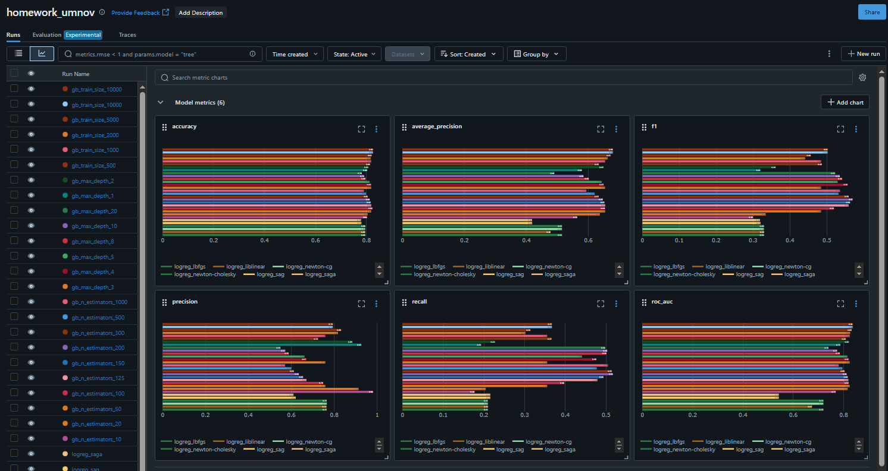
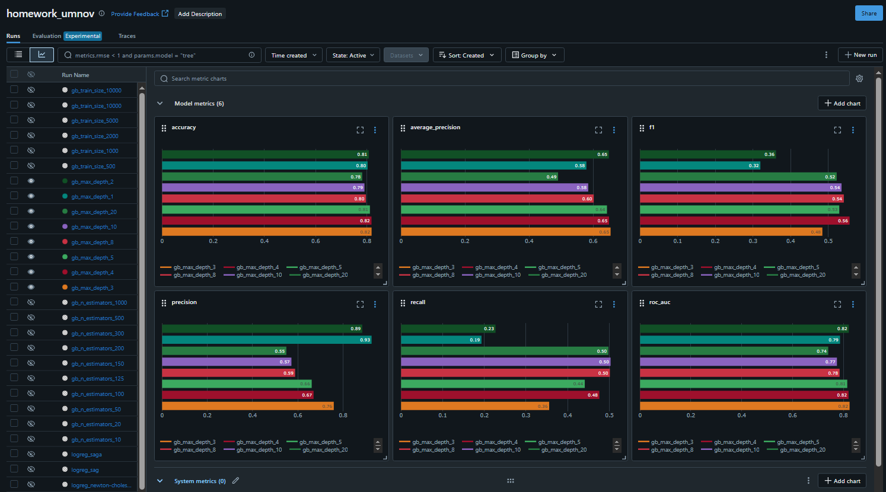
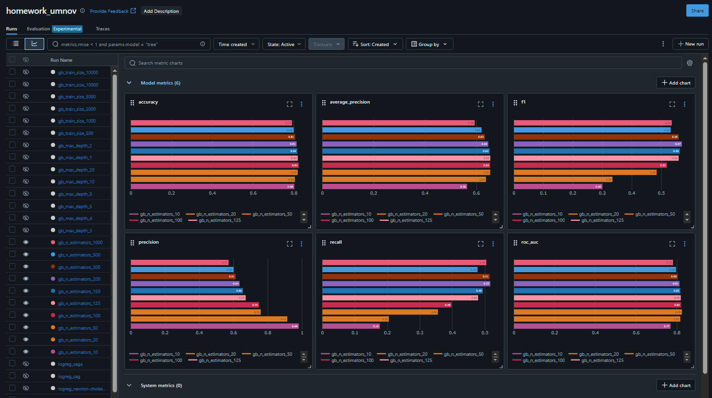
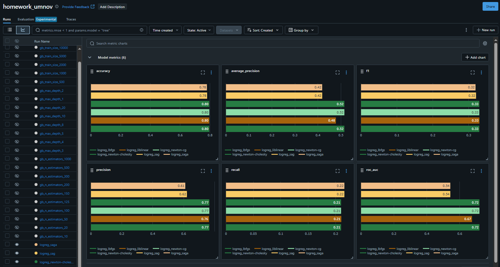

# Отчет по эксперементам коллеги в MLflow

* http://158.160.2.37:5000/#/experiments/13?searchFilter=&orderByKey=attributes.start_time&orderByAsc=false&startTime=ALL&lifecycleFilter=Active&modelVersionFilter=All+Runs&datasetsFilter=W10%3D&compareRunsMode=CHART

В равных условиях, на одинаком наборе фичей, 
для заданного набора значений гиперпараметра сравниваются метрики качества 
**(accuracy, f1, precision, recall, roc-auc, average-precision)** 
по ним определяется лучшее значение исследуемого гиперпараметра

По значениям метрик качества в проведённых экспериментах наиболее эффективными можно назвать 
модели градиентного бустинга над решающими деревьями с **train size** 10000, а также 
модели градиентного бустинга над решающими со значениями **n_estimators** 125, 150, 200. 

Как часто бывает наиболее эффективными при работе с табличными данными оказались ансамбли из решающих деревьев)

### Сравнение max_depth для градиентного бустинга над решающими деревьями

Сравнивались значения 1, 2, 3, 4, 5, 8, 10, 20

Для всех рассмотренных значений **max_depth** по большинству метрик одно из наиболее высоких значений 
демонстрируем модель градиентного бустинга с глубиной максимальной глубиной решающих деревьев **4**, 
значит в рамках этих результатов эксперимента полагаем данное значение лучшим для рассматриваемого гиперпараметра.

### Сравнение n_estimators для градиентного бустинга над решающими деревьями

Сравнивались значения 10, 20, 50, 100, 125, 150, 200, 300, 500, 1000

Для всех рассмотренных значений **n_estimators** все метрики качества имеют очень близкие значения,
но стабильно показывают одни из наилучших значений метрик - модели градиентного бустинга 
с **300**, **200**, **150** решающими деревьями, но из соображений, что этот гиперпараметр 
имеет прямое влияние на архитектуру модели - вес и вычислительную сложность, то если наиболее лёгкая 
модель имеет метрики качества на том же уровне, что и более тяжёлые модели, в рамках этих результатов эксперимента
полагаем модель с меньшим значением (**150**) лучшим для рассматриваемого гиперпараметра.

### Сравнение solver для логистической регрессии

Сравнивались значения `lbfgs`, `liblinear`, `newton-cg`, `newton-cholesskiy`, `sag`, `saga`

Для всех рассмотренных значений **solver** по большинству метрик одни из наиболее высоких значений 
демонстрируют модели логистической регрессии с алгоритмами оптимизации **newton-cholesskiy**, **newton-cg** и **lbfgs**, 
но алгоритмы newton-cholesskiy и newton-cg очень вычислительно трудозатратные, так как используют аппроксимацию 2 порядка
вычисляя полные матрицу якоби и гессиан на каждом шаге, а **lbfgs** считается универсальным и оптимальным для большинства задач,
значит в рамках этих результатов эксперимента полагаем **lbfgs** наилучшим алгоритмом оптимизации.